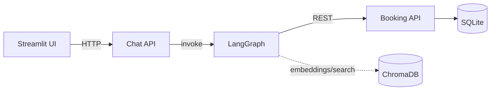
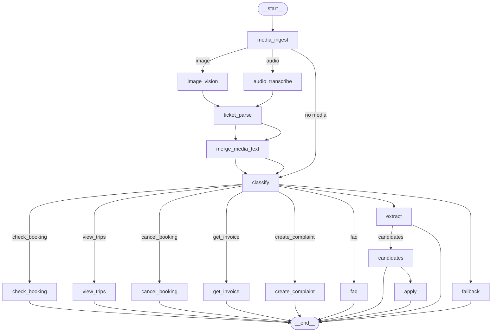
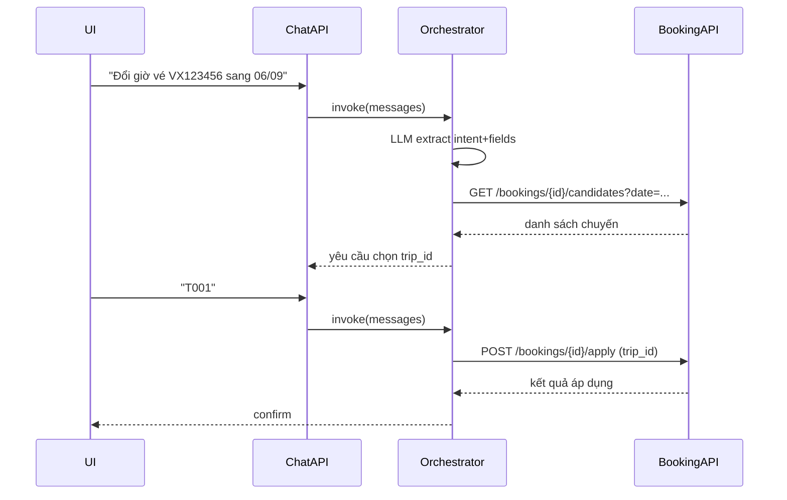

# Verxere Chatbot – Design Document

## 1. Kiến trúc tổng quan
- Kiến trúc 3 tầng:
  - Tầng trình diễn (UI): `src/ui/booking_ui.py` (Streamlit) – nhập hội thoại, hiển thị kết quả.
  - Tầng dịch vụ nghiệp vụ:
    - Booking API: `src/app/main.py` (FastAPI + SQLite) – bookings, trips, cancel, invoice, complaints.
    - Chat API: `src/app/chat_api.py` (FastAPI) – cổng vào orchestrator (LangGraph).
  - Tầng AI Orchestrator: `src/orchestrator/*` (LangGraph + LLM/OpenAI + RAG/ChromaDB) – phân loại intent, trích xuất trường, điều hướng node, truy vấn FAQ.
- Dữ liệu:
  - SQLite: `src/data/mock.db` (seed từ `schema.sql`, `seed.py`).
  - FAQ/RAG: `src/data/faq_data.csv` + ChromaDB persistent `src/data/chroma_db`.
- Khả năng mở rộng media (image/voice): `src/orchestrator/media/*` (skeleton), đưa qua các node tiền xử lý trước khi classify.

### Sơ đồ tổng quan (Mermaid)


## 2. Lựa chọn tech / framework
- FastAPI: hiệu năng tốt, type hints/Pydantic rõ ràng, docs tự động (Swagger UI).
- Streamlit: dựng UI hội thoại nhanh, phù hợp demo/prototyping.
- LangGraph: biểu diễn workflow có trạng thái, dễ điều hướng intent → node; hỗ trợ visualize.
- OpenAI (GPT-4o/GPT-4o-mini, text-embedding-3-small): NLU/IE cho tiếng Việt tốt, đa phương thức.
- ChromaDB: vector store embedded, lưu persistence đơn giản trong local, tốc độ truy vấn tốt.
- SQLite: đơn giản, nhẹ, phù hợp mock và demo; logic tính phí/đổi/hủy tập trung ở service layer.
- Requests: gọi nội bộ Booking API từ orchestrator nodes (đơn giản – dễ thay thế bằng async/httpx).

Lý do: các công nghệ nhẹ, nhanh tích hợp; tối ưu cho vòng lặp thử nghiệm và trình diễn. Dễ thay thế/scale khi cần (ví dụ chuyển SQLite → Postgres, Requests → httpx async, ChromaDB → dịch vụ vector khác).

## 3. Sơ đồ thiết kế hệ thống

### 3.1. Orchestrator graph
(Đã có script export png/mermaid; sơ đồ logic)


### 3.2. Data flow (change time)


### 3.3. ERD – Mock DB (SQLite)
```mermaid
erDiagram
  BOOKINGS {
    TEXT booking_id PK
    TEXT route_from
    TEXT route_to
    TEXT depart_time
    TEXT status
    TEXT seat_class
    TEXT user_phone
  }

  TRIPS {
    TEXT trip_id PK
    TEXT route_from
    TEXT route_to
    TEXT depart_time
    INTEGER seats_total
    INTEGER seats_available
    INTEGER base_price
  }

  BOOKING_CHANGES {
    INTEGER id PK
    TEXT booking_id FK
    TEXT old_time
    TEXT new_time
    INTEGER fee
  }

  COMPLAINTS {
    INTEGER id PK
    TEXT booking_id FK
    TEXT complaint_type
    TEXT description
    TEXT status
    TEXT created_at
  }

  BOOKINGS ||--o{ BOOKING_CHANGES : has
  BOOKINGS ||--o{ COMPLAINTS : has
  TRIPS ||--o{ BOOKINGS : matches_by(route, time)
```

## 4. Test & Continuous Improvement Pipeline
- Kiểm thử thủ công (local):
  - Seed DB: `python src/data/seed.py`
  - Booking API: `uvicorn src.app.main:app --port 8080`
  - Chat API: `uvicorn src.app.chat_api:app --port 8081`
  - UI: `streamlit run src/ui/booking_ui.py`
- Kiểm thử smoke: `src/tests/smoke_sqlite.py` (có thể mở rộng thành pytest suite: endpoints, stateful intents, RAG retrieval).
- Visualize pipeline: `python src/scripts/visualize_graph.py` (xuất `src/scripts/graph.png`).
- RAG strict mode: chỉ trả lời từ tài liệu retrieve; nếu không đủ tương đồng → báo không có thông tin (giảm hallucination).
- Continuous Improvement (đề xuất):
  - Thu thập logs anonymized (intent, fields, node outcome), feedback loop cho prompt tuning.
  - A/B test prompts/models; theo dõi các KPI: precision intent, success rate change/cancel, RAG answer helpfulness.
  - Tự động rebuild embeddings khi `faq_data.csv` thay đổi.
  - CI (chưa hỗ trợ): khi bật, thêm lint (`ruff`/`flake8` + `mypy`), test (`pytest`), security (`pip-audit`).

## 5. Các hạng mục liên quan
- Bảo mật & tuân thủ:
  - Không log PII thô, mask số điện thoại/định danh.
  - Rate limit, CORS trên APIs khi public.
  - Quản lý `OPENAI_API_KEY` bằng `.env`/secrets.
- Hiệu năng & mở rộng:
  - Chuyển service calls sang async (`httpx`), tránh block; dùng connection pooling.
  - Cache kết quả RAG phổ biến; prefetch/async index update cho Chroma.
  - Tách container: booking_api, chat_api, ui; mount `src/data` qua volume.
- Khả năng phục hồi:
  - Idempotency cho `apply`/`cancel`; retry với backoff.
  - Ghi nhận thay đổi ghế/chuyến bằng transaction trong SQLite (hoặc move to Postgres).
- Media roadmap:
  - GPT-4o Vision để trích xuất từ ảnh vé; Whisper/gpt-4o-mini-transcribe cho audio.
  - Chuẩn hóa text media → unified message trước classify.
- Observability:
  - Structured logs per request-id, debug flags ở nodes chính.
  - Dashboards (sau này): số intent/giờ, tỉ lệ thành công, lỗi API downstream.
